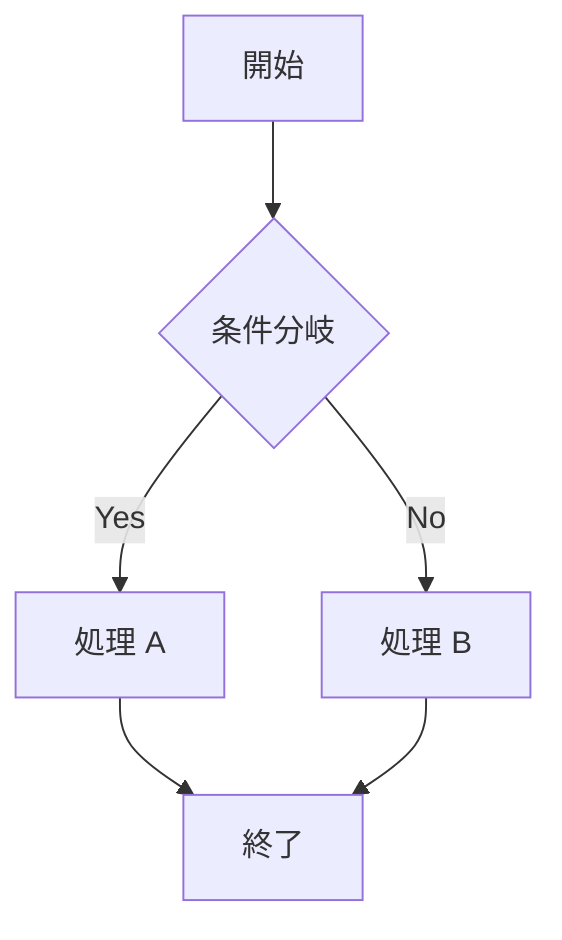
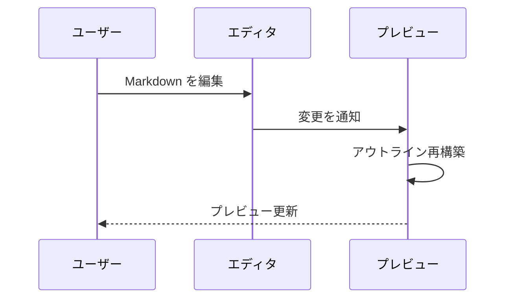

# Markdown サンプル — 全要素チェック用

**Markdown Preview Outline** 拡張機能の動作確認用サンプルファイル。
アウトラインサイドバー・パンくずナビゲーション・スクロール同期の検証を目的として、
すべての見出しレベルと主要な Markdown 要素を網羅している。

---

## 1. 見出し（Headings）

見出しレベルの階層構造を確認する。

### 1.1 第3レベルの見出し

第3レベルの見出しは `###` で始まる。
アウトラインにはツリー構造で表示される。

#### 1.1.1 第4レベルの見出し

ネストが深くなるほどアウトラインでのインデントが増える。

##### 1.1.1.1 第5レベルの見出し

さらに深いネスト。設定の `maxLevel` で表示レベルを制限できる。

###### 1.1.1.1.1 第6レベルの見出し

最も深い見出しレベル。`maxLevel: 3` に設定するとこのレベルは非表示になる。

### 1.2 別の第3レベル

第3レベルが複数ある場合のアウトライン表示を確認する。
同一階層の見出しはアウトラインで同じインデントに並ぶ。

#### 1.2.1 並列する第4レベル（その1）

サンプルテキスト。スクロールするとパンくずが更新される。

#### 1.2.2 並列する第4レベル（その2）

同じ深さの見出しが並ぶケース。
アウトラインのアクティブ項目がスクロールに合わせて切り替わる。

---

## 2. テキスト装飾（Inline Formatting）

### 2.1 強調・斜体・取り消し線

段落内でさまざまなインライン装飾を使用できる。

- **太字（Bold）** は `**テキスト**` または `__テキスト__` で表現する
- *斜体（Italic）* は `*テキスト*` または `_テキスト_` で表現する
- ***太字かつ斜体*** は `***テキスト***` で表現する
- ~~取り消し線（Strikethrough）~~ は `~~テキスト~~` で表現する
- `インラインコード` はバッククォートで囲む

### 2.2 リンクと画像

[VS Code 公式サイト](https://code.visualstudio.com) へのリンク。

[タイトル付きリンク](https://code.visualstudio.com "VS Code — コードエディタ") はホバー時にタイトルが表示される。

自動リンク: <https://marketplace.visualstudio.com>

参照形式のリンク: [Markdown 仕様][commonmark]

[commonmark]: https://spec.commonmark.org/

画像の埋め込み（代替テキストのみ表示）:


### 2.3 絵文字・特殊文字

一部のレンダラーでは絵文字コードが使える: :rocket: :tada: :white_check_mark:

HTML エンティティ: &copy; &amp; &lt; &gt; &mdash; &hellip;

エスケープ: \*アスタリスク\* \`バッククォート\` \# ハッシュ

---

## 3. リスト（Lists）

### 3.1 順序なしリスト

- 項目 A
- 項目 B
  - 入れ子の項目 B-1
  - 入れ子の項目 B-2
    - さらに深い項目 B-2-a
    - さらに深い項目 B-2-b
  - 入れ子の項目 B-3
- 項目 C
- 項目 D

別のマーカーも使用可能:

* アスタリスク形式
* もう一つ

+ プラス形式
+ もう一つ

### 3.2 順序付きリスト

1. 最初の項目
2. 二番目の項目
3. 三番目の項目
   1. 入れ子の順序付きリスト
   2. 二番目の入れ子
   3. 三番目の入れ子
4. 四番目の項目
5. 五番目の項目

開始番号の指定も可能:

42. 四十二番目から始まるリスト
43. 四十三番目
44. 四十四番目

### 3.3 タスクリスト（Task List）

- [x] 完了したタスク
- [x] これも完了
- [ ] 未完了のタスク
- [ ] もう一つ未完了
  - [x] 入れ子の完了タスク
  - [ ] 入れ子の未完了タスク

### 3.4 定義リスト

一部のレンダラーがサポートする定義リスト:

用語 1
: 定義 1 の説明文。複数行にわたる場合もある。

用語 2
: 定義 2 の最初の説明。
: 定義 2 の二番目の説明。

---

## 4. コードブロック（Code Blocks）

### 4.1 フェンスドコードブロック

```javascript
// JavaScript のサンプルコード
function fibonacci(n) {
  if (n <= 1) return n;
  return fibonacci(n - 1) + fibonacci(n - 2);
}

const results = Array.from({ length: 10 }, (_, i) => fibonacci(i));
console.log('フィボナッチ数列:', results);
```

```typescript
// TypeScript のサンプルコード
interface User {
  id: number;
  name: string;
  email: string;
  roles: ('admin' | 'editor' | 'viewer')[];
}

function greetUser(user: User): string {
  const roleList = user.roles.join(', ');
  return `こんにちは、${user.name} さん（${roleList}）`;
}

const user: User = {
  id: 1,
  name: '田中 太郎',
  email: 'tanaka@example.com',
  roles: ['admin', 'editor'],
};

console.log(greetUser(user));
```

```python
# Python のサンプルコード
from typing import Generator

def primes(limit: int) -> Generator[int, None, None]:
    """エラトステネスの篩で素数を生成するジェネレータ"""
    sieve = [True] * (limit + 1)
    sieve[0] = sieve[1] = False
    for i in range(2, int(limit**0.5) + 1):
        if sieve[i]:
            for j in range(i * i, limit + 1, i):
                sieve[j] = False
    return (i for i in range(2, limit + 1) if sieve[i])

print(list(primes(50)))
```

```bash
# シェルスクリプトのサンプル
#!/bin/bash

PROJECT_DIR="$(cd "$(dirname "$0")" && pwd)"
BUILD_DIR="${PROJECT_DIR}/dist"

echo "ビルド開始: $(date)"
mkdir -p "${BUILD_DIR}"

npm run compile && \
npm run lint && \
echo "ビルド完了: $(date)" || \
echo "ビルド失敗" >&2
```

```sql
-- SQL のサンプルコード
SELECT
    u.id,
    u.name,
    COUNT(o.id)    AS order_count,
    SUM(o.amount)  AS total_amount,
    AVG(o.amount)  AS avg_amount
FROM users u
LEFT JOIN orders o
    ON u.id = o.user_id
   AND o.created_at >= DATE_SUB(NOW(), INTERVAL 30 DAY)
WHERE u.status = 'active'
GROUP BY u.id, u.name
HAVING order_count > 0
ORDER BY total_amount DESC
LIMIT 20;
```

### 4.2 インデントによるコードブロック

    // インデント（スペース4つ）によるコードブロック
    const x = 42;
    const y = x * 2;
    console.log(y); // 84

### 4.3 言語指定なしのコードブロック

```
言語指定なしのコードブロック。
シンタックスハイライトは適用されない。
プレーンテキストのコードや設定ファイルなどに使う。
```

---

## 5. 引用（Blockquotes）

### 5.1 単純な引用

> 引用ブロック。
> 複数行にわたる場合は各行の先頭に `>` を付ける。

> 引用ブロック内では他の Markdown 要素も使える。
>
> **太字**、*斜体*、`コード` も使用可能。

### 5.2 入れ子の引用

> 第1レベルの引用
>
> > 第2レベルの入れ子引用
> >
> > > 第3レベルの深い入れ子引用
> >
> > 第2レベルに戻る

### 5.3 引用内のリスト

> 引用内のリスト:
>
> - 引用内の箇条書き1
> - 引用内の箇条書き2
>   - 入れ子の箇条書き
>
> 1. 引用内の番号付きリスト
> 2. 二番目の項目

---

## 6. テーブル（Tables）

### 6.1 基本的なテーブル

| 名前       | 型        | デフォルト | 説明                           |
|-----------|-----------|-----------|-------------------------------|
| `position` | `string`  | `"right"` | サイドバーの表示位置            |
| `maxLevel` | `number`  | `6`       | 表示する見出しの最大レベル（1〜6） |
| `showBreadcrumb` | `boolean` | `true` | パンくずの表示/非表示        |
| `scrollSyncOffset` | `number` | `5` | スクロール同期の基準行オフセット |

### 6.2 配置指定付きテーブル

| 左揃え     |    中央揃え    |     右揃え |
|:---------|:------------:|----------:|
| データ A   |    100       |     ¥1,000 |
| データ B   |    250       |     ¥2,500 |
| データ C   |     50       |       ¥500 |
| **合計**  |  **400**    | **¥4,000** |

### 6.3 テーブル内の Markdown

| 機能            | サポート | 備考                             |
|----------------|:------:|----------------------------------|
| **太字**        |  ✅   | `**テキスト**`                    |
| *斜体*          |  ✅   | `*テキスト*`                      |
| `インラインコード` |  ✅   | バッククォートで囲む               |
| [リンク][link]  |  ✅   | 参照形式・インライン形式ともに可     |
| 画像            |  ⚠️   | レンダラーによって異なる            |
| ~~打ち消し線~~   |  ✅   | `~~テキスト~~`                    |

[link]: https://example.com

---

## 7. 水平線（Horizontal Rules）

水平線の書き方は複数ある。

---

***

___

---

## 8. 数式（Math）

一部のレンダラー（KaTeX / MathJax）がサポートする数式表現。

### 8.1 インライン数式

オイラーの等式: $e^{i\pi} + 1 = 0$

二次方程式の解: $x = \dfrac{-b \pm \sqrt{b^2 - 4ac}}{2a}$

### 8.2 ブロック数式

$$
\int_{-\infty}^{\infty} e^{-x^2} \, dx = \sqrt{\pi}
$$

$$
\sum_{n=1}^{\infty} \frac{1}{n^2} = \frac{\pi^2}{6}
$$

$$
\mathbf{F} = m\mathbf{a} = m\frac{d^2\mathbf{r}}{dt^2}
$$

---

## 9. HTML の直接記述

Markdown 内では HTML タグを直接使用できる。

### 9.1 HTML 要素

<details>
<summary>クリックして詳細を展開</summary>

詳細な内容を記述できる。
Markdown も使えるレンダラーがある。

```javascript
console.log('詳細の中のコードブロック');
```

</details>

<br>

<div style="background: #f0f0f0; padding: 12px; border-radius: 4px;">
  カスタムスタイルを持つ <strong>HTML ブロック</strong>。
</div>

### 9.2 HTML テーブル

<table>
  <thead>
    <tr>
      <th>列 1</th>
      <th>列 2</th>
      <th>列 3</th>
    </tr>
  </thead>
  <tbody>
    <tr>
      <td rowspan="2">セル（2行結合）</td>
      <td>A</td>
      <td>B</td>
    </tr>
    <tr>
      <td colspan="2">セル（2列結合）</td>
    </tr>
  </tbody>
</table>

---

## 10. 脚注（Footnotes）

脚注を使うと本文を補足できる[^1]。
複数の脚注も使える[^2]。
長い説明は別の脚注[^long]にまとめると読みやすい。

[^1]: 脚注1の内容。

[^2]: 脚注2の内容。`インラインコード` も書ける。

[^long]: 長い脚注の例。
    複数の段落にわたる脚注は、後続の行をインデントする。
    このように複数行にまたがって記述できる。

---

## 11. YAML フロントマター（Front Matter）

---
title: "サンプルドキュメント"
author: "テストユーザー"
date: 2026-03-05
tags:
  - markdown
  - vscode
  - extension
---

YAML フロントマターをドキュメント冒頭に記述する場合がある。
このサンプルでは途中に配置しているため、通常のコードブロックとして表示される。

---

## 12. Mermaid 図（一部レンダラー対応）





---

## 13. 長文コンテンツ（スクロールテスト用）

スクロール同期とパンくずナビゲーションのテスト用長文コンテンツ。

### 13.1 段落の連続

Lorem ipsum の代わりに日本語のダミーテキストを使用する。

吾輩は猫である。名前はまだ無い。どこで生れたかとんと見当がつかぬ。何でも薄暗いじめじめした所でニャーニャー泣いていた事だけは記憶している。吾輩はここで始めて人間というものを見た。しかもあとで聞くとそれは書生という人間中で一番獰悪な種族であったそうだ。

国境の長いトンネルを抜けると雪国であった。夜の底が白くなった。信号所に汽車が止まった。向側の座席から娘が立って来て、島村の前のガラス窓を落した。雪の冷気が流れこんだ。娘は窓いっぱいに乗り出して、遠方の灯を捜すように、夜の底を眺めていた。

つれづれなるままに、日暮らし、硯にむかひて、心にうつりゆくよしなしごとを、そこはかとなく書きつくれば、あやしうこそものぐるほしけれ。山里は冬ぞさびしさまさりける人目も草もかれぬと思へば。

### 13.2 技術的な説明文

マークダウン（Markdown）は、2004年にジョン・グルーバーとアーロン・スワーツによって作成された軽量マークアップ言語。プレーンテキスト形式で書かれた文書を、構造化された HTML などのフォーマットに変換することを目的としている。

設計思想は「読みやすさ」と「書きやすさ」を最優先すること。Markdown で書かれた文書は、変換前のプレーンテキスト状態でも十分に読めるよう設計されている。HTML のように大量のタグで埋め尽くされたソースとは対照的。

現在では GitHub、Stack Overflow、Reddit、各種 Wiki システム、多数のブログプラットフォームなど、Web 上の多くのサービスで採用されている。技術文書の執筆ツールとして広く普及しており、README ファイルや API ドキュメントの標準フォーマットになっている。

### 13.3 リストを含む長文

プログラミング言語の特徴:

**コンパイル言語:**
- **C / C++**: システムプログラミングの基盤。メモリ管理を直接制御できる。
- **Rust**: 所有権システムによりメモリ安全性をコンパイル時に保証する。
- **Go**: シンプルな構文と高速なコンパイル、標準ライブラリの充実。
- **Java**: JVM 上で動作するクロスプラットフォーム言語。エンタープライズでの採用が多い。

**インタープリタ / JIT 言語:**
- **Python**: 可読性が高く、データサイエンス・機械学習分野で広く使われる。
- **JavaScript / TypeScript**: Web フロントエンドの唯一の選択肢。Node.js でサーバーサイドでも利用される。
- **Ruby**: 「プログラマの幸せ」を追求した言語設計。Ruby on Rails で有名。
- **PHP**: Web アプリケーション開発に特化。WordPress などで広く利用される。

### 13.4 引用と参照

> ソフトウェアは、書かれるより読まれることのほうがずっと多い。
> — Guido van Rossum（Python 設計者）

> Any fool can write code that a computer can understand.
> Good programmers write code that humans can understand.
> — Martin Fowler

> デバッグは、コードを書くよりも難しい。したがって、
> 自分が書けるだけのコードの中で最高に賢いコードを書くと、
> それをデバッグする能力がない、ということになる。
> — Brian W. Kernighan

### 13.5 コード例を含む説明

非同期処理のパターン。

**コールバック（古典的な方法）:**

```javascript
fetchData(url, function(error, data) {
  if (error) {
    console.error('エラー:', error);
    return;
  }
  processData(data, function(error, result) {
    if (error) {
      console.error('処理エラー:', error);
      return;
    }
    saveResult(result, function(error) {
      if (error) {
        console.error('保存エラー:', error);
        return;
      }
      console.log('完了');
    });
  });
});
```

**Promise（改善された方法）:**

```javascript
fetchData(url)
  .then(data => processData(data))
  .then(result => saveResult(result))
  .then(() => console.log('完了'))
  .catch(error => console.error('エラー:', error));
```

**async/await（現代的な方法）:**

```javascript
async function execute(url) {
  try {
    const data = await fetchData(url);
    const result = await processData(data);
    await saveResult(result);
    console.log('完了');
  } catch (error) {
    console.error('エラー:', error);
  }
}
```

---

## 14. エッジケース

### 14.1 空の見出し

####

##### （空の第5レベル見出し）

### 14.2 特殊文字を含む見出し

### `コード` を含む見出し

### **太字** と *斜体* を含む見出し

### 記号を含む見出し: @#$%^&*()

### 長い見出し — これはとても長いタイトルで、アウトラインサイドバーでのテキスト省略（`text-overflow: ellipsis`）の動作を確認するためのもの

### 14.3 連続する同レベルの見出し

#### セクション A

テキスト A。

#### セクション B

テキスト B。

#### セクション C

テキスト C。

#### セクション D

テキスト D。

#### セクション E

テキスト E。

### 14.4 見出しレベルの飛び

# H1

### H3（H2 をスキップ）

##### H5（H4 をスキップ）

###### H6

### 14.5 段落内改行と段落区切り

同じ段落の1行目。
ソフト改行（行末にスペース2つ）による改行。

新しい段落。空行で段落を区切る。

---

## 15. 最終セクション — まとめ

### 15.1 チェックリスト

拡張機能のテストで確認すべき項目:

- [ ] アウトラインサイドバーが表示される
- [ ] すべての見出しがアウトラインに表示される
- [ ] アウトラインのクリックでプレビューがスクロールする
- [ ] スクロールに合わせてアクティブ項目がハイライトされる
- [ ] パンくずナビゲーションが現在位置を示す
- [ ] パンくずクリックでプレビューがスクロールする
- [ ] サイドバーの幅をドラッグで変更できる
- [ ] トグルボタンでサイドバーを折りたたみ/展開できる
- [ ] タブ移動後もアウトラインが正常表示される
- [ ] `Ctrl+Shift+V` で開いてもアウトラインが表示される
- [ ] ツリーの折りたたみ/展開が動作する

### 15.2 設定の組み合わせテスト

| 設定              | 値       | 期待される動作                         |
|-----------------|---------|-------------------------------------|
| `position`      | `left`  | サイドバーが左端に表示される             |
| `position`      | `right` | サイドバーが右端に表示される（デフォルト） |
| `maxLevel`      | `2`     | H1・H2 のみアウトラインに表示される     |
| `maxLevel`      | `6`     | 全見出しがアウトラインに表示される        |
| `showBreadcrumb`| `false` | パンくずが非表示になる                  |
| `scrollSyncOffset` | `0`  | スクロール同期の基準が先頭行になる        |

### 15.3 おわりに

**Markdown Preview Outline** 拡張機能の全機能を検証するためのサンプルファイル。
上から下までスクロールしながら以下を確認する:

1. パンくずナビゲーションが現在のセクション階層を正確に表示する
2. アウトラインサイドバーのアクティブ項目がスクロールに追従する
3. 深いネストの見出し（H4〜H6）が正しくツリー表示される
4. 長い見出しテキストが省略表示（`…`）される
5. 見出しレベルの飛び（H1 → H3 など）が正しく処理される

以上がサンプルコンテンツ。
